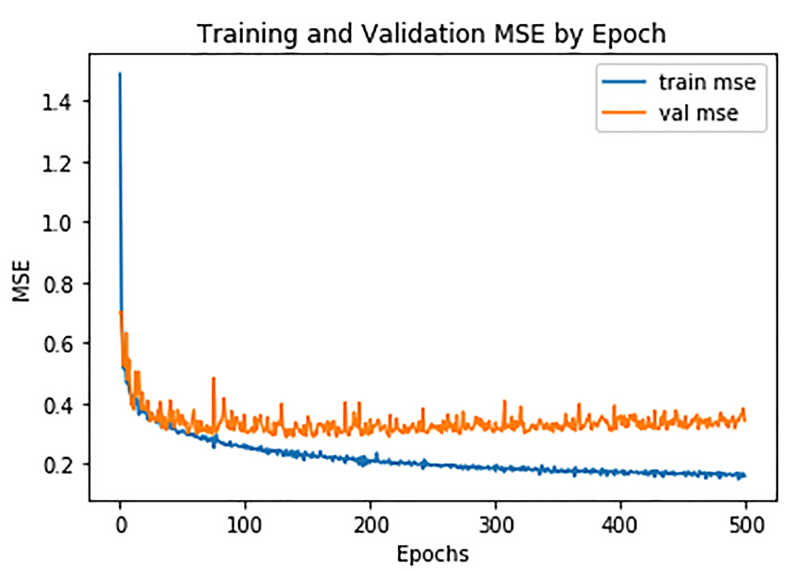

# keras代码积累

## 数据预处理

### 截断或padding成统一长度

```python
from tensorflow.keras.preprocessing import sequence 

max_len = 100 

train_data = sequence.pad_sequences(train_data, maxlen=max_len) 
test_data = sequence.pad_sequences(test_data, maxlen=max_len)
```

## 结果可视化

### 绘制模型结构

```python
# 第一种
model.summary()

# 第二种
tf.keras.utils.plot_model(best_model, show_shapes=True, expand_nested=True)
```

### 绘制训练曲线

keras模型训练过程可以保存history变量，该变量是一个字典类型。  
我们可以将其转化为DataFrame，并进行绘图

```python
import pandas as pd
import matplotlib.pyplot as plt

hist = pd.DataFrame(history.history)
hist['epoch'] = history.epoch

plt.plot(hist['epoch'], hist['mse'], label='train mse') 
plt.plot(hist['epoch'], hist['val_mse'], label='val mse') 
plt.xlabel('Epochs') 
plt.ylabel('MSE') 
plt.title('Training and Validation MSE by Epoch') 
plt.legend() 
plt.show()
```



#### 对绘制曲线作光滑处理

对曲线进行高斯光滑处理，具体的处理函数为

```python
import numpy as np 
def smooth_curve(values, std=5): 
    width = std * 4 
    x = np.linspace(-width, width, 2 * width + 1) 
    kernel = np.exp(-(x / 5) ** 2) 

    values = np.array(values) 
    weights = np.ones_like(values) 

    smoothed_values = np.convolve(values, kernel, mode='same')
    smoothed_weights = np.convolve(weights, kernel, mode='same') 

    return smoothed_values / smoothed_weights
```


## 训练时的回调函数

### ModelCheckpoint

```python
checkpoint = ModelCheckpoint("./model.h5", monitor='val_acc', verbose=1, save_best_only=True, mode='max')
```


### Early stopping

```python
early_stopping = EarlyStopping(monitor='val_loss',
                          min_delta=0,
                          patience=3,
                          verbose=1,
                          restore_best_weights=True
                          )


```


### Learning schedule

```python
reduce_learningrate = ReduceLROnPlateau(monitor='val_loss',
                              factor=0.2,
                              patience=3,
                              verbose=1,
                              min_delta=0.0001)
```

