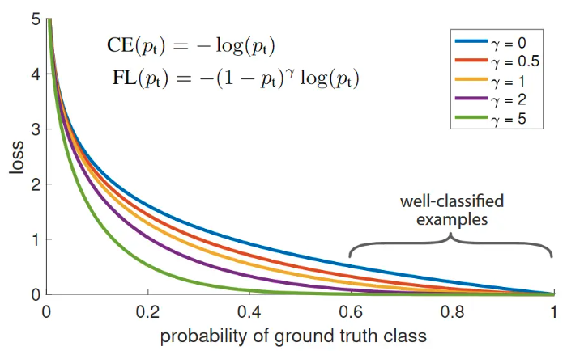

# Imbalance classification

## Focal Loss

### 二分类

Focal loss 是在 [Focal Loss for Dense Object Detection](https://arxiv.org/abs/1708.02002v2) 中为了解决数据类别不平衡而提出的。

它是一个动态缩放的交叉熵损失，其中缩放因子随着正确类的置信度的增加衰减到零。因此可以在训练过程中自动降低简单示例的贡献，并快速将模型集中在困难示例上。



Focal loss定义为
$$
FL(p_t) = -(1-p_t)^{\gamma}log(p_t)
$$
其中，$p_t$为模型对样本的正确类别估计概率

当误分类时，$p_t$很小，调制因子接近1，loss 不受影响。当$p_t$ →1，因子趋近于0，分类良好的样本的损失权重下降，如上图。

当 $\gamma = 0$， Focal loss 相当于 Cross Entropy loss。实际应用中一般取$\gamma = 2$。

另一种平衡版本的 focal loss， 在论文的实验中能获得更好的结果：
$$
FL(p_t) = -\alpha_t(1-p_t)^{\gamma}log(p_t)
$$

[pytorch实现](https://github.com/facebookresearch/fvcore/blob/main/fvcore/nn/focal_loss.py)


```python
import torch
from torch.nn import functional as F


def sigmoid_focal_loss(
    inputs: torch.Tensor,
    targets: torch.Tensor,
    alpha: float = -1,
    gamma: float = 2,
    reduction: str = "none",
) -> torch.Tensor:
    """
    Loss used in RetinaNet for dense detection: https://arxiv.org/abs/1708.02002.
    Args:
        inputs: A float tensor of arbitrary shape.
                The predictions for each example.
        targets: A float tensor with the same shape as inputs. Stores the binary
                 classification label for each element in inputs
                (0 for the negative class and 1 for the positive class).
        alpha: (optional) Weighting factor in range (0,1) to balance
                positive vs negative examples. Default = -1 (no weighting).
        gamma: Exponent of the modulating factor (1 - p_t) to
               balance easy vs hard examples.
        reduction: 'none' | 'mean' | 'sum'
                 'none': No reduction will be applied to the output.
                 'mean': The output will be averaged.
                 'sum': The output will be summed.
    Returns:
        Loss tensor with the reduction option applied.
    """
    inputs = inputs.float()  # (B, C)
    targets = targets.float()  # (B, C)
    p = torch.sigmoid(inputs)  # (B, C)
    ce_loss = F.binary_cross_entropy_with_logits(inputs, targets, reduction="none") # (B, C)
    p_t = p * targets + (1 - p) * (1 - targets)
    loss = ce_loss * ((1 - p_t) ** gamma)  # (B, C)

    if alpha >= 0:
        alpha_t = alpha * targets + (1 - alpha) * (1 - targets) # # (B, C)
        loss = alpha_t * loss # (B, C)

    if reduction == "mean":
        loss = loss.mean()
    elif reduction == "sum":
        loss = loss.sum()

    return loss
```

### 多分类

首先，明确一下`loss`函数的输入：

一个`pred`，`shape`为 (bs, num_classes)，并且未经过`softmax` ；

一个`target`，`shape`为 (bs)，也就是一个向量，并且未经过`one_hot`编码。

通过前面的公式可以得出，我们需要在loss实现是做三件事情：

找到当前`batch`内每个样本对应的类别标签，然后根据预先设置好的`alpha`值给每个样本分配类别权重
计算当前`batch`内每个样本在类别标签位置的`softmax`值，作为公式里的 
 ，因为不管是`focal loss`还是`cross_entropy_loss`，每个样本的n个概率中不属于真实类别的都是用不到的
计算原始的`cross_entropy_loss`，但不能求平均，需要得到每个样本的`cross_entropy_loss`，因为需要对每个样本施加不同的权重


pytorch 实现，以三分类为例

```python
import torch
import torch.nn as nn


class MultiClassFocalLossWithAlpha(nn.Module):
    def __init__(self, alpha=[0.2, 0.3, 0.5], gamma=2, reduction='mean'):
        """
        :param alpha: 权重系数列表，三分类中第0类权重0.2，第1类权重0.3，第2类权重0.5
        :param gamma: 困难样本挖掘的gamma
        :param reduction:
        """
        super(MultiClassFocalLossWithAlpha, self).__init__()
        self.alpha = torch.tensor(alpha)
        self.gamma = gamma
        self.reduction = reduction

    def forward(self, pred, target):
        alpha = self.alpha[target]  # 为当前batch内的样本，逐个分配类别权重，shape=(bs), 一维向量
        log_softmax = torch.log_softmax(pred, dim=1) # 对模型裸输出做softmax再取log, shape=(bs, 3)
        logpt = torch.gather(log_softmax, dim=1, index=target.view(-1, 1))  # 取出每个样本在类别标签位置的log_softmax值, shape=(bs, 1)
        logpt = logpt.view(-1)  # 降维，shape=(bs)
        ce_loss = -logpt  # 对log_softmax再取负，就是交叉熵了
        pt = torch.exp(logpt)  #对log_softmax取exp，把log消了，就是每个样本在类别标签位置的softmax值了，shape=(bs)
        focal_loss = alpha * (1 - pt) ** self.gamma * ce_loss  # 根据公式计算focal loss，得到每个样本的loss值，shape=(bs)
        if self.reduction == "mean":
            return torch.mean(focal_loss)
        if self.reduction == "sum":
            return torch.sum(focal_loss)
        return focal_loss
```