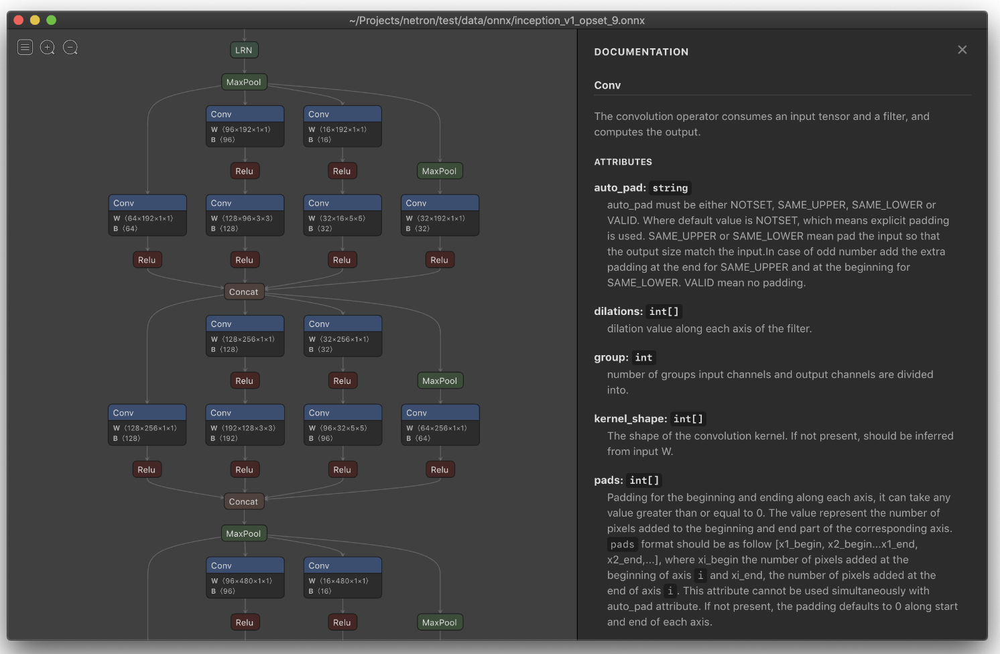

# 模型结构可视化

## Netron
Netron is a viewer for neural network, deep learning and machine learning models.

Netron supports ONNX, TensorFlow Lite, Caffe, Keras, Darknet, PaddlePaddle, ncnn, MNN, Core ML, RKNN, MXNet, MindSpore Lite, TNN, Barracuda, Tengine, CNTK, TensorFlow.js, Caffe2 and UFF.

Netron has experimental support for PyTorch, TensorFlow, TorchScript, OpenVINO, Torch, Vitis AI, kmodel, Arm NN, BigDL, Chainer, Deeplearning4j, MediaPipe, MegEngine, ML.NET and scikit-learn.

https://github.com/lutzroeder/Netron

