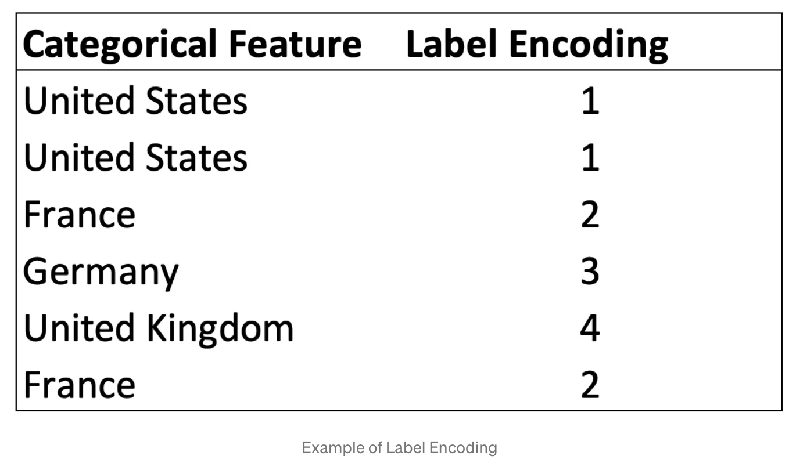
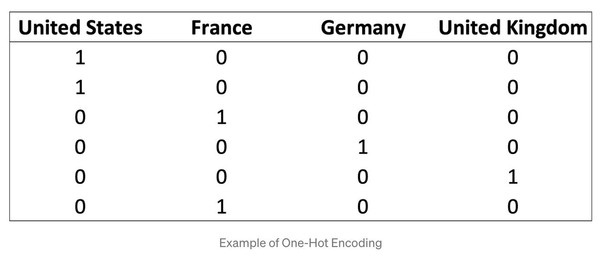
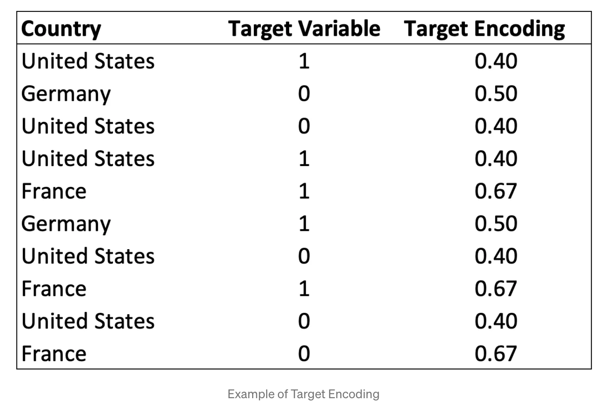

# 处理类别特征

对于类别特征，一般为字符串，像XGBoost或其他一些模型，不支持这样的特征类别，需要进行转换。

## Label Encoding

最常用的方法是Label Encoding，将类别特征转换为数字

**这种方法会引起一些问题，如，距离和顺序，对于KMeans算法会有影响**



## One-Hot Encoding

对于非顺序类别特征，正确的做法是**One-Hot Encoding**
这种方法也有一些缺点，特别地，当存在大量二值特征的时候，这种方法不适合基于距离的算法，如，聚类模型。另外，额外生成的大量特征也会导致维度灾难。这意味着数据集的维度增大，也变得更稀疏。也就是说，特征的增加，导致我们会面临没有足够的数据对于每种特征组合



## Target Encoding

它包括用目标变量中的平均响应替换分类特征中的每个组。

获取Target Encoding的过程比较简单，可以概括为：

1. 按类别对数据进行分组
2. 计算每组目标变量的平均值
3. 将平均值分配给属于该组的每个观察值
   
这可以通过几行代码来实现：

```python
encodings = data.groupby('Country')['Target Variable'].mean().reset_index()
data = data.merge(encodings, how='left', on='Country')
data.drop('Country', axis=1, inplace=True)
```

Target Encoding 是一种强大的解决方案，因为它避免生成大量特征，就像 One-Hot Encoding 的情况一样，保持数据集的维度与原始维度相同。



也可以用python库 `category_encoders`来实现
```python
import pandas as pd
from category_encoders import TargetEncoder

encoder = TargetEncoder()
df['Target Encoding'] = encoder.fit_transform(df['Country'], df['Target Variabel'])
```

## 总结

处理分类特征是数据科学家的一项常见任务，但通常人们并不确切知道正确处理这些特征的最佳实践是什么。

对于非序数类别，应不惜一切代价避免标签编码，它包括用相对随机的整数替换类别。

相反，One-Hot Encoding 和 Target Encoding 是更可取的解决方案。 One-Hot Encoding 可能是最常见的解决方案，在现实生活中表现良好。 Target Encoding是一种鲜为人知但很有前途的技术，它还可以保持数据集的维度一致，从而提高性能。

**One-Hot Encoding**
优点：
One-hot encoding works well with nominal data and eliminates any issue of higher categorical values influencing data, since we are creating each column in the binary 1 or 0.


缺点：
One-hot encoding can create very high dimensionality depending on the number of categorical features you have and the number of categories per feature. This can become problematic not only in smaller datasets but also potentially in larger datasets as well. Combining PCA with one-hot encoding can help reduce that dimensionality when running models. One-hot encoding can also be problematic in tree-based models. See here for further discussion.

**Target Encoding**
优点：
Target encoding is a simple and quick encoding method that doesn’t add to the dimensionality of the dataset. Therefore it may be used as a good first try encoding method.

缺点：
Target encoding is dependent on the distribution of the target which means target encoding requires careful validation as it can be prone to overfitting. This method is also dataset-specific and will only show significant improvements some of the time.
