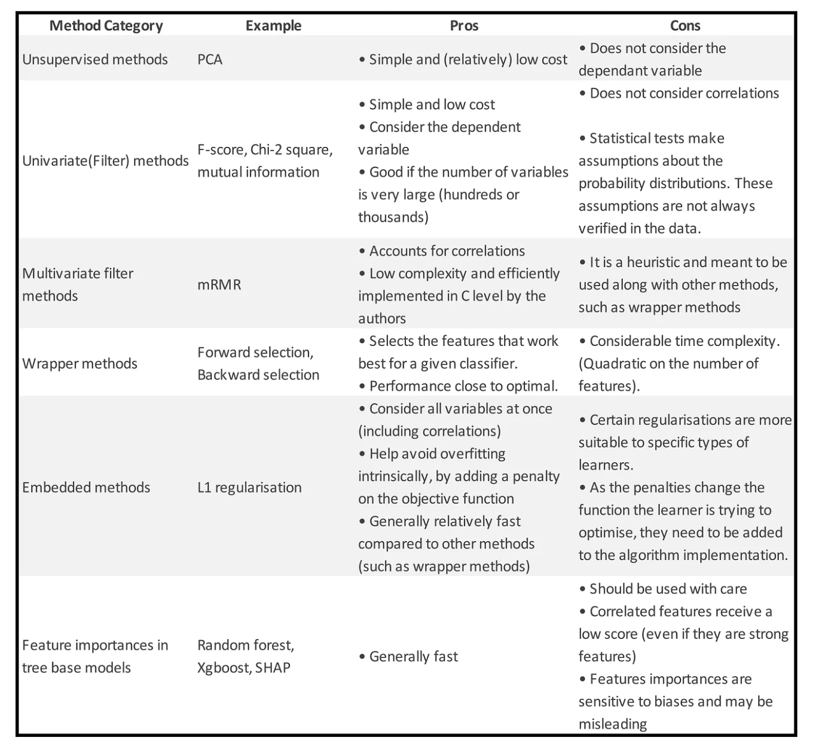
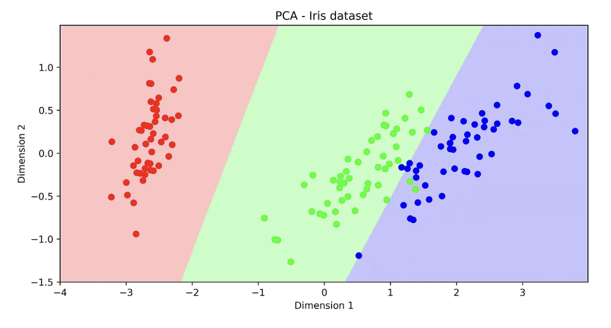
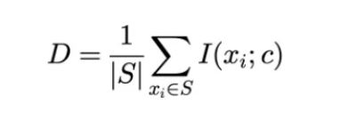
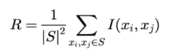
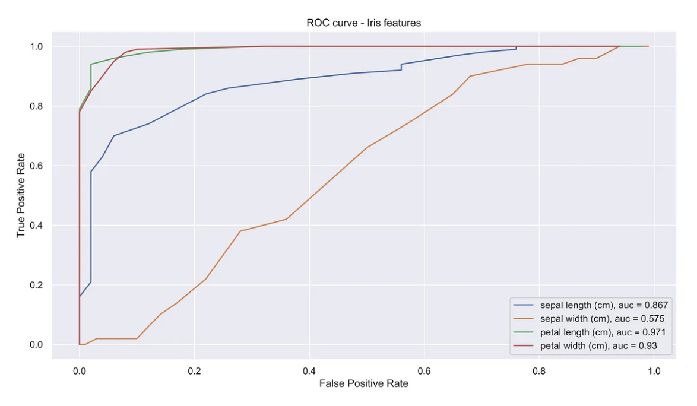

# Feature selection for classification

## Boxplots and Violin plots

```python
import pandas as pd
import seaborn as sns
sns.set()
df = pd.DataFrame(data.data,columns=data.feature_names)
df['target'] = data.target
df_temp = pd.melt(df,id_vars='target',value_vars=list(df.columns)[:-1], 
                  var_name="Feature", value_name="Value")
g = sns.FacetGrid(data = df_temp, col="Feature", col_wrap=4, size=4.5,sharey = False)
g.map(sns.boxplot,"target", "Value");
g = sns.FacetGrid(data = df_temp, col="Feature", col_wrap=4, size=4.5,sharey = False)
g.map(sns.violinplot,"target", "Value")
```

## Summary table

各种特征筛选汇总


## Unsupervised methods

PCA

```python
from sklearn.datasets import load_iris
from sklearn.decomposition import PCA
from sklearn.svm import SVC
import matplotlib.pyplot as plt
from matplotlib.colors import ListedColormap
import numpy as np
h = .01
x_min, x_max = -4,4
y_min, y_max = -1.5,1.5
# loading dataset
data = load_iris()
X, y = data.data, data.target
# selecting first 2 components of PCA
X_pca = PCA().fit_transform(X)
X_selected = X_pca[:,:2]
# training classifier and evaluating on the whole plane
clf = SVC(kernel='linear')
clf.fit(X_selected,y)
xx, yy = np.meshgrid(np.arange(x_min, x_max, h),
                     np.arange(y_min, y_max, h))
Z = clf.predict(np.c_[xx.ravel(), yy.ravel()])
Z = Z.reshape(xx.shape)
# Plotting
cmap_light = ListedColormap(['#FFAAAA', '#AAFFAA', '#AAAAFF'])
cmap_bold = ListedColormap(['#FF0000', '#00FF00', '#0000FF'])
plt.figure(figsize=(10,5))
plt.pcolormesh(xx, yy, Z, alpha=.6,cmap=cmap_light)
plt.title('PCA - Iris dataset')
plt.xlabel('Dimension 1')
plt.ylabel('Dimension 2')
plt.scatter(X_pca[:,0],X_pca[:,1],c=data.target,cmap=cmap_bold)
plt.show()
```




## Univariate filter methods

Filter methods aim at ranking the importance of the features without making use of any type of classification algorithm.

Univariate filter methods evaluate each feature individually and do not consider feature interactions. These methods consist of providing a score to each feature, often based on statistical tests.

The scores usually either measure the dependency between the dependent variable and the features (e.g. Chi2 and, for regression, Pearls correlation coefficient), or the difference between the distributions of the features given the class label (F-test and T-test).

The scores often make assumptions about the statistical properties of the underlying data. Understanding these assumptions is important to decide which test to use, even though some of them are robust to violations of the assumptions.

Scores based on statistical tests provide a p-value, that may be used to rule out some features. This is done if the p-value is above a certain threshold (typically 0.01 or 0.05).

Common tests include:


The package sklearn implements some filter methods. However, as most of them are based on statistical tests, statistics packages (such asstatsmodels) could also be used.

One example is shown below:
```python
from sklearn.feature_selection import f_classif, chi2, mutual_info_classif
from statsmodels.stats.multicomp import pairwise_tukeyhsd
from sklearn.datasets import load_iris
data = load_iris()
X,y = data.data, data.target
chi2_score, chi_2_p_value = chi2(X,y)
f_score, f_p_value = f_classif(X,y)
mut_info_score = mutual_info_classif(X,y)
pairwise_tukeyhsd = [list(pairwise_tukeyhsd(X[:,i],y).reject) for i in range(4)]
print('chi2 score        ', chi2_score)
print('chi2 p-value      ', chi_2_p_value)
print('F - score score   ', f_score)
print('F - score p-value ', f_p_value)
print('mutual info       ', mut_info_score)
print('pairwise_tukeyhsd',pairwise_tukeyhsd)

# -----------------------------------------------

Out:
chi2 score         [ 10.82   3.71 116.31  67.05]
chi2 p-value       [0.   0.16 0.   0.  ]
F - score score    [ 119.26   49.16 1180.16  960.01]
F - score p-value  [0. 0. 0. 0.]
mutual info        [0.51 0.27 0.98 0.98]
pairwise_tukeyhsd [[True, True, True], [True, True, True], [True, True, True], [True, True, True]]
```


## Multivariate Filter methods

这类方法考虑了变量之间的相关性，并且没有考虑任何分类算法。

### mRMR

最小化冗余最大化相关性
mRMR (minimum Redundancy Maximum Relevance) is a heuristic algorithm to find a close to optimal subset of features by considering both the features importances and the correlations between them.

这个想法是，即使两个特征高度相关，如果它们高度相关，将它们都添加到特征集中可能不是一个好主意。 在那种情况下，添加这两个特征会增加模型的复杂性（增加过度拟合的可能性）但不会增加重要信息，因为特征之间存在相关性。

在包含 N 个特征的集合 S 中，特征 (D) 的相关性计算如下：


其中 I 是互信息算子。

特征的冗余表示如下：


集合 S 的 mRMR 分数定义为 (D - R)。 目标是找到具有最大值 (D-R) 的特征子集。 然而，在实践中，我们执行增量搜索（也称为前向选择），在每个步骤中，我们添加产生最大 mRMR 的特征。

该算法由算法作者自己用 C 语言实现。 您可以在此处找到包的源代码以及原始论文。

在名称 pymrmr 上创建了一个（未维护的）python 包装器。 如果 pymrmr 出现问题，我建议直接调用 C 级函数。

The code below exemplifies the use of pymrmr . Note that the columns of the pandas data-frame should be formatted as described in the C level package (here).

```python
import pandas as pd
import pymrmr
df = pd.read_csv('some_df.csv')
# Pass a dataframe with a predetermined configuration. 
# Check http://home.penglab.com/proj/mRMR/ for the dataset requirements
# df：数据文件（pandas.DataFrame）
    # 第一列要是标签
    # 其他列要是特征量
    # 列的名称要是字符串
# 内部选择方法（‘MIQ’或‘MID’）（str）
    # MIQ:互信息熵
    # MID:互信息差
# K：要选取的特征数量（int）

pymrmr.mRMR(df, 'MIQ', 10)
Output:

*** This program and the respective minimum Redundancy Maximum Relevance (mRMR)
     algorithm were developed by Hanchuan Peng <hanchuan.peng@gmail.com>for
     the paper
     "Feature selection based on mutual information: criteria of
      max-dependency, max-relevance, and min-redundancy,"
      Hanchuan Peng, Fuhui Long, and Chris Ding,
      IEEE Transactions on Pattern Analysis and Machine Intelligence,
      Vol. 27, No. 8, pp.1226-1238, 2005.
*** MaxRel features ***
 Order    Fea     Name    Score
 1        765     v765    0.375
 2        1423    v1423   0.337
 3        513     v513    0.321
 4        249     v249    0.309
 5        267     v267    0.304
 6        245     v245    0.304
 7        1582    v1582   0.280
 8        897     v897    0.269
 9        1771    v1771   0.269
 10       1772    v1772   0.269
*** mRMR features ***
 Order    Fea     Name    Score
 1        765     v765    0.375
 2        1123    v1123   24.913
 3        1772    v1772   3.984
 4        286     v286    2.280
 5        467     v467    1.979
 6        377     v377    1.768
 7        513     v513    1.803
 8        1325    v1325   1.634
 9        1972    v1972   1.741
 10       1412    v1412   1.689
Out[1]:
 ['v765',
  'v1123',
  'v1772',
  'v286',
  'v467',
  'v377',
  'v513',
  'v1325',
  'v1972',
  'v1412']
```

## Wrapper methods

包装方法背后的主要思想是搜索哪一组特征最适合特定的分类器。 这些方法可以总结如下，并且在使用的搜索算法方面有所不同。

选择一个性能指标（可能性、AIC、BIC、F1 分数、准确度、MSE、MAE……），记为 M。
选择一个分类器/回归器/…，在这里记为 C。
使用给定的搜索方法搜索不同的特征子集。 对于每个子集 S，执行以下操作：
使用 S 作为分类器的特征，以交叉验证模式训练和测试 C；
从交叉验证过程中获得平均分数（对于度量 M）并将该分数分配给子集 S；
选择一个新子集并重做步骤 a。
Detailing Step 3
Step three leaves unspecified the type which search method will be used. Testing all possible subsets of features is prohibitive (Brute Force selection) in virtually any situation since it would require performing step 3 an exponential number of times (2 to the power of the number of features). Besides the time complexity, with such a large number of possibilities, it would be likely that a certain combination of features performs best simply by random chance, which makes the brute force solution more prone to overfitting.

Search algorithms tend to work well in practice to solve this issue. They tend to achieve a performance close to the brute force solution, with much less time complexity and less chance of overfitting.

Forward selection and Backward selection (aka pruning) are much used in practice, as well as some small variations of their search process.

Backward selection consists of starting with a model with the full number of features and, at each step, removing the feature without which the model has the highest score. Forward selection goes on the opposite way: it starts with an empty set of features and adds the feature that best improves the current score.

Forward/Backward selection are still prone to overfitting, as, usually, scores tend to improve by adding more features. One way to avoid such situation is to use scores that penalize the complexity of the model, such as AIC or BIC.

An illustration of a wrapper method structure is shown below. It is important to note that the feature set is (1) found through a search method and (2) cross-validated on the same classifier it is intended to be used for.


Step three also leaves open the cross-validation parameters. Usually, a k-fold procedure is used. Using a large k, however, introduces extra complexity to the overall wrapper method.

A Python Package for wrapper methods
mlxtend (http://rasbt.github.io/mlxtend/) is a useful package for diverse data science-related tasks. The wrapper methods on this package can be found on SequentialFeatureSelector. It provides Forward and Backward feature selection with some variations.

The package also provides a way to visualize the score as a function of the number of features through the function plot_sequential_feature_selection.

The example below was extracted from the package’s main page.

from mlxtend.feature_selection import SequentialFeatureSelector as SFS
from mlxtend.plotting import plot_sequential_feature_selection as plot_sfs
from sklearn.linear_model import LinearRegression
from sklearn.datasets import load_boston
boston = load_boston()
X, y = boston.data, boston.target
lr = LinearRegression()
sfs = SFS(lr, 
          k_features=13, 
          forward=True, 
          floating=False, 
          scoring='neg_mean_squared_error',
          cv=10)
sfs = sfs.fit(X, y)
fig = plot_sfs(sfs.get_metric_dict(), kind='std_err')
plt.title('Sequential Forward Selection (w. StdErr)')
plt.grid()
plt.show()

Embedded methods

Training a classifier boils down to an optimization problem, where we try to minimize a function of its parameters (noted here as 𝜃). This function is known loss function (noted as 𝐿(𝜃)).

In a more general framework, we usually want to minimize an objective function that takes into account both the loss function and a penalty (or regularisation)(Ω(𝜃)) to the complexity of the model:

obj(𝜃)=𝐿(𝜃)+Ω(𝜃)

Embedded methods for Linear classifiers
For linear classifiers (e.g. Linear SVM, Logistic Regression), the loss function is noted as :


Where each xʲ corresponds to one data sample and Wᵀxʲ denotes the inner product of the coefficient vector (w₁,w₂,…w_n) with the features in each sample.

For Linear SVM and Logistic Regression the hinge and logistic losses are, respectively:


The two most common penalties for linear classifiers are the L-1 and L-2 penalties:


The higher the value of λ, the stronger the penalty and the optimal objective function will tend to end up in shrinking more and more the coefficients w_i.

The “L1” penalty is known to create sparse models, which simply means that, it tends to select some features out of the model by making some of the coefficients equal zero during the optimization process.

Another common penalty is L-2. While L-2 shrinks the coefficients and therefore helps avoid overfitting, it does not create sparse models, so it is not suitable as a feature selection technique.

For some linear classifiers (Linear SVM, Logistic Regression), the L-1 penalty can be efficiently used, meaning that there are efficient numerical methods to optimize the resulting objective function. The same is not true for several other classifiers (various Kernel SVM methods, Decision Trees,…). Therefore, different regularisation methods should be used for different classifiers.

An example of Logistic regression with regularisation is shown below, and we can see that the algorithms rule out some of the features as C decreases (think if C as 1/λ).

import numpy as np
import matplotlib.pyplot as plt
from sklearn.svm import LinearSVC
from sklearn.model_selection import ShuffleSplit
from sklearn.model_selection import GridSearchCV
from sklearn.utils import check_random_state
from sklearn import datasets
from sklearn.linear_model import LogisticRegression
rnd = check_random_state(1)
# set up dataset
n_samples = 3000
n_features = 15
# l1 data (only 5 informative features)
X, y = datasets.make_classification(n_samples=n_samples,
                                        n_features=n_features, n_informative=5,
                                        random_state=1)
cs = np.logspace(-2.3, 0, 50)
coefs = []
for c in cs:
    clf = LogisticRegression(solver='liblinear',C=c,penalty='l1')
    # clf = LinearSVC(C=c,penalty='l1', loss='squared_hinge', dual=False, tol=1e-3)
    
    clf.fit(X,y)
    coefs.append(list(clf.coef_[0]))
    
coefs = np.array(coefs)
plt.figure(figsize=(10,5))
for i,col in enumerate(range(n_features)):
    plt.plot(cs,coefs[:,col])
plt.xscale('log')
plt.title('L1 penalty - Logistic regression')
plt.xlabel('C')
plt.ylabel('Coefficient value')
plt.show()

Feature importances from tree-based models
Another common feature selection technique consists in extracting a feature importance rank from tree base models.

The feature importances are essentially the mean of the individual trees’ improvement in the splitting criterion produced by each variable. In other words, it is how much the score (so-called “impurity” on the decision tree notation) was improved when splitting the tree using that specific variable.

They can be used to rank features and then select a subset of them. However, the feature importances should be used with care, as they suffer from biases and, and presents an unexpected behavior regarding highly correlated features regardless of how strong they are.

As shown in this paper, random forest feature importances are biased towards features with more categories. Besides, if two features are highly correlated, both of their scores largely decrease, regardless of the quality of the features.

Below is an example of how to extract the feature importances from a random forest. Although a regressor, the process would be the same for a classifier.

from sklearn.datasets import load_boston
from sklearn.ensemble import RandomForestRegressor
import numpy as np
boston = load_boston()
X = boston.data
Y = boston.target
feat_names = boston.feature_names 
rf = RandomForestRegressor()
rf.fit(X, Y)
print("Features sorted by their score:")
print(sorted(zip(map(lambda x: round(x, 4), rf.feature_importances_), feat_names), 
             reverse=True))
Out:
Features sorted by their score:
[(0.4334, 'LSTAT'), (0.3709, 'RM'), (0.0805, 'DIS'), (0.0314, 'CRIM'), (0.0225, 'NOX'), (0.0154, 'TAX'), (0.0133, 'PTRATIO'), (0.0115, 'AGE'), (0.011, 'B'), (0.0043, 'INDUS'), (0.0032, 'RAD'), (0.0016, 'CHAS'), (0.0009, 'ZN')]
Extra: main Impurity scores for tree models
As explained above, the “impurity” is a score used by the decision tree algorithm when deciding to split a node. There are many decision tree algorithms (IDR3, C4.5, CART,…), but the general rule is that the variable with which we split a node in the tree is the one that generates the highest improvement on the impurity.

The most common impurities are the Gini Impurity and Entropy. An improvement on the Gini impurity is known as “Gini importance” while An improvement on the Entropy is the Information Gain.


SHAP: Reliable feature importances from tree models
(Thanks to 
Henrique Gasparini Fiuza do Nascimento
 for the suggestion!)

SHAP is actually much more than just that. It is an algorithm to provide model explanation out of any predictive model. For tree based models, however, it is specially useful: the authors developed a high speed and exact (not only local) explanation for such models, compatible with XGBoost, LightGBM, CatBoost, and scikit-learn tree models.

I encourage checking out the explanation capabilities provided by SHAP (such as Feature dependance, interaction effects, model monitoring…). Below, I plot (only) the feature importances output by SHAP, which are more reliable than those output by the original tree model when ranking them for feature selection. This example was extracted from their github page.

import xgboost
import shap
# load JS visualization code to notebook
shap.initjs()
# train XGBoost model
X,y = shap.datasets.boston()
model = xgboost.train({"learning_rate": 0.01}, xgboost.DMatrix(X, label=y), 100)
# explain the model's predictions using SHAP values
# (same syntax works for LightGBM, CatBoost, and scikit-learn models)
explainer = shap.TreeExplainer(model)
shap_values = explainer.shap_values(X)
shap.summary_plot(shap_values, X, plot_type="bar")

Conclusion — when to use each method?
Embedded methods are usually very efficient to avoid overfitting and select useful variables. They are also time efficient as they are embedded on the objective function. Their main downside is that they may not be available to the desired classifier.

Wrapper methods tend to work very well in practice. However, they are computationally expensive, specially when dealing hundreds of features. But if you have the computational resources, they are an excellent way to go.

If the feature set is very large (on the order of hundreds or thousands), because filter methods are fast, they can work well as a first stage of selection, to rule out some variables. Subsequently another method can be applied to the already reduced feature set. This is particular useful if you want to create combinations of features, multiplying or dividing them, for example.

References
An Introduction to Variable and Feature Selection

Bias in random forest variable importance measures: Illustrations, sources and a solution

Feature Selection for Classification: A Review

Machine Learning
Feature Selection
Python
Data Science
1.99K


2


## Feature Ranking with the ROC curve


这个技术最适合用于二分类任务。将该技术用于多分类时，需要使用micro或macro平均，或者基于准则的多比较（multiple comparison）（类似于pairwise Tukey’s range test）


```python
from sklearn.datasets import load_iris
import matplotlib.pyplot as plt
from sklearn.metrics import auc
import numpy as np
# loading dataset
data = load_iris()
X, y = data.data, data.target
y_ = y == 2
plt.figure(figsize=(13,7))
for col in range(X.shape[1]):
    tpr,fpr = [],[]
    for threshold in np.linspace(min(X[:,col]),max(X[:,col]),100):
        detP = X[:,col] < threshold
        tpr.append(sum(detP & y_)/sum(y_))# TP/P, aka recall
        fpr.append(sum(detP & (~y_))/sum((~y_)))# FP/N
        
    if auc(fpr,tpr) < .5:
        aux = tpr
        tpr = fpr
        fpr = aux
    plt.plot(fpr,tpr,label=data.feature_names[col] + ', auc = '\
                           + str(np.round(auc(fpr,tpr),decimals=3)))
plt.title('ROC curve - Iris features')
plt.xlabel('False Positive Rate')
plt.ylabel('True Positive Rate')
plt.legend()
plt.show()
```



## Multivariate Filter methods


## Reference
[1] [Blog](https://towardsdatascience.com/feature-selection-techniques-for-classification-and-python-tips-for-their-application-10c0ddd7918b)