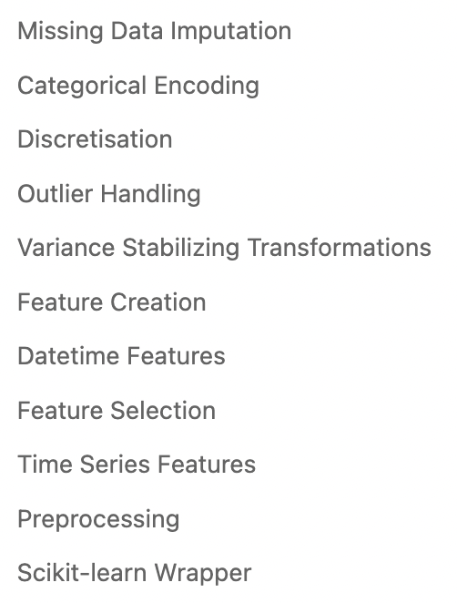

# Some Useful Python Libraries

## Feature Engineering

### 1. Feature Engine

A Python library for Feature Engineering and Selection

[Github](https://github.com/feature-engine/feature_engine), [Documentation](https://feature-engine.trainindata.com/en/latest/user_guide/index.html)

