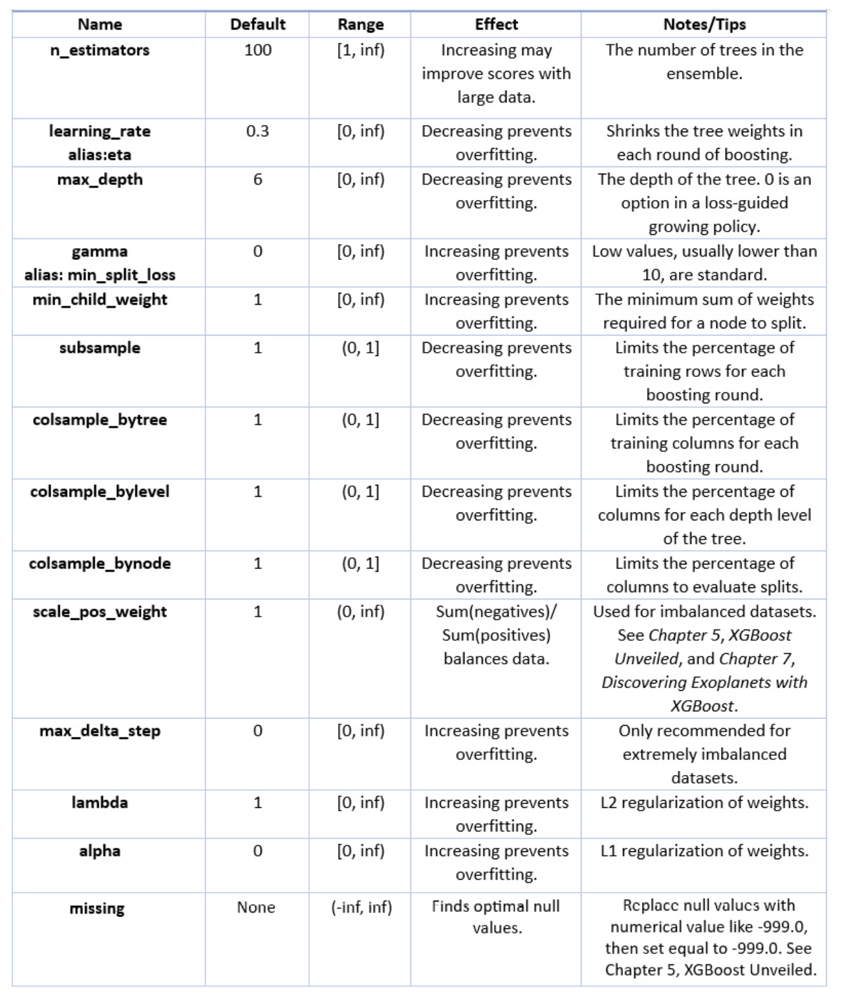

# XGBoost Hyperparameters

## 超参数列表及说明

### n_estimators

`n_estimators`为在残差上训练的树的数量，默认值为100.

### learning_rate

`learning_rate`用于缩减每一轮boosting的树的权重，默认值为0.3。通过减小`learning_rate`，需要更多的树来得到更好的分数。减小`learning_rate`可以防止过拟合，因为向前传递的权重大小变小了。

### max_depth

`max_depth`决定了树的长度，等效于树的分支的轮树，默认值为6。  
限制`max_depth`的大小，可以防止过拟合，因为单棵树只能生长至`max_depth`所允许的长度。

### gamma

为拉格朗日乘子，`gamma`提供了节点在进一步分支前必须超过的阈值（基于损失函数）。`gamma`没有上限值，默认值为0，通常大于10即认为非常高了。增加`gamma`值，会使得模型更保守。

### min_child_weight

`min_child_weight`对应于节点分支到子节点所需的最小权重和，默认值为1。如果权重和小于`min_child_weight`的值，则不再进行分支。通过增加`min_child_weight`的值，可以降低过拟合.

### subsample

`subsample`限制每一轮boosting所使用的训练样本百分比，默认值为1。将`subsample`从100%减小，可以降低过拟合。

### colsample_bytree

类似于`subsample`，`colsample_bytree`基于所给定的百分比来随机选择特定的列，默认值为1。`colsample_bytree`对限制列的影响和降低variance很有用。

## 应用early stopping

`Early stopping`是通用的方法，用来限制机器学习模型训练轮数。

一般需要设置`eval_set`,`eval_metric`和`early_stopping_rounds`