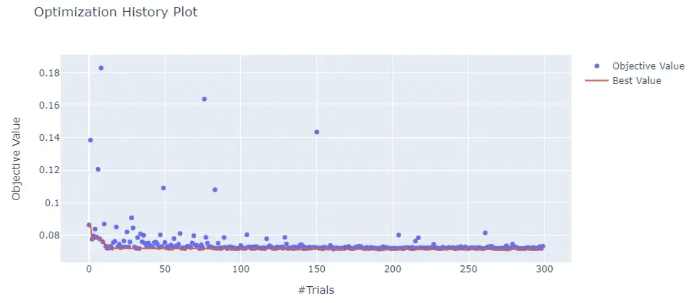
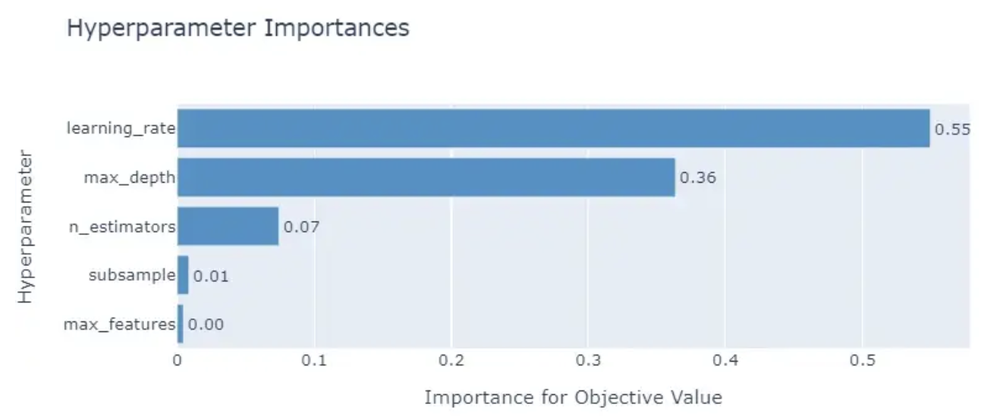

# Optuna笔记

摘自[博客](https://towardsdatascience.com/why-is-everyone-at-kaggle-obsessed-with-optuna-for-hyperparameter-tuning-7608fdca337c)

主要特点：

* 具有使用循环和条件定义类python的搜索空间的能力。
* 与平台无关的 API——您可以调整几乎任何 ML、DL 包/框架的估计器，包括 Sklearn、PyTorch、TensorFlow、Keras、XGBoost、LightGBM、CatBoost 等。
* 一大套优化算法，内置了early stopping和pruning features。
* 只需很少或无需更改代码即可轻松实现并行化。
* 内置支持对搜索结果进行可视化探索。

## Optuna基础

使用Optuna api来调节一个简单的函数$(x-1)^2+(y+3)^2$。我们知道，函数在 $x=1,y=-3$ 处达到最小值。

示例代码如下：

```python
import optuna  # pip install optuna

# 所要优化的目标函数
def objective(trial):
    # 优化参数1
    x = trial.suggest_float("x", -7, 7)
    # 优化参数2
    y = trial.suggest_float("y", -7, 7)
    return (x - 1) ** 2 + (y + 3) ** 2
```

其中，变量`trial`为optuna的特定的Trial对象，用于优化每个超参数。

其具有`suggest_float`方法用来设置超参数名称和定义优化值的范围，如

```python
x = trial.suggest_float("x", -7, 7)
```

这和在做GridSearch时的 `{"x": np.arange(-7, 7)}` 基本一致.
开始优化，我们需要从Optuna中创建一个`study`，并将函数`objective`传入该方法：

```python
study = optuna.create_study()
study.optimize(objective, n_trials=100)  # number of iterations

>>> study.best_params
{'x': 0.9448382515046126, 'y': -3.074822812248314}
```

我们这里进行了100次尝试

```python
>>> len(study.trials)
100
```

**Optuna有一个与其他类似优化工具不同的优点是，Optuna不会在搜索结束后忘掉历史搜索过的参数。如果对当前得到的最佳结果不满意，可以再次调用`optimize`和所设置的搜索空间**

```python
study.optimize(objective, n_trials=100)

>>> study.best_params
{'x': 1.0212303395174502, 'y': -3.015575206335039}
```

这个结果比前面的结果更加接近最优值了。

## Optuna 术语和约定

在Optuna，整个优化过程被称为`study`。例如，创建一个study，使用log损失作为metric来优化XGBoost参数：

```python
study = optuna.create_study()

>>> type(study)
optuna.study.Study
```

一个study需要一个可以优化的函数。一般地， 这个函数由用户定义，应被命名为`objective` , 并具有以下特点：

```python
def objective(trial: optuna.Trial):
    """Conventional optimization function
    signature for optuna.
    """
    custom_metric = ...
    return custom_metric
```

这个函数需要接收`optuna.Trial`对象作为参数，并返回我们想优化的metric。

如第一个例子所示，一个`study`是一系列的试验，我们使用从所给定的搜索空间中的一组超参数来评估目标函数。
`study`中的每个试验被表示为`optuna.Trial`类，这个类是Optuna对这些参数搜索最优值的关键。
为了开始一个`study`，我们需要创建一个有方向的study对象：

```python
study = optuna.create_study(direction="maximize")
```

如果我们要优化的指标是像 ROC AUC 或准确性这样的点性能分数，我们将方向设置为最大化。 否则，我们通过将方向设置为最小化来最小化 RMSE、RMSLE、对数损失等损失函数。

然后，我们将调用研究的优化方法，传递目标函数名称和我们想要的试验次数：

```python
# Optimization with 100 trials
study.optimize(objective, n_trials=100)
```

## 定义搜索空间

通常，在目标函数中需要做的第一件事是，使用Optuna的内置方法来创建搜索空间：
```python
def objective(trial):
    rf_params = {
        "n_estimators": trial.suggest_int(name="n_estimators", low=100, high=2000),
        "max_depth": trial.suggest_int("max_depth", 3, 8),
        "max_features": trial.suggest_categorical(
            "max_features", choices=["auto", "sqrt", "log2"]
        ),
        "n_jobs": -1,
        "random_state": 1121218,
    }

    rf = RandomForestRegressor(**rf_params)
    ...
```

在上面的目标函数中，我们创建了一个关于随机森林超参数的小搜索空间。

这个搜索空间只是一个简单的字典。为了创建可能的搜索值，你必须使用trial对象的`suggest_*`函数。

这些函数至少需要超参数名称、最小值和最大值来搜索范围或分类超参数的可能类别。

为了使空间更小，suggest_float 和 suggest_int 有额外的步骤或日志参数：

```python
from sklearn.ensemble import GradientBoostingRegressor

def objective(trial):
    params = {
        "n_estimators": trial.suggest_int("n_estimators", 1000, 10000, step=200),
        "learning_rate": trial.suggest_float("learning_rate", 1e-7, 0.3, log=True),
        "max_depth": trial.suggest_int("max_depth", 3, 12, step=2),
        "random_state": 1121218,
    }
    boost_reg = GradientBoostingRegressor(**params)
    rmsle = ...
    return rmsle
```

上面，我们将 `n_estimators` 的分布按 200 个间隔分箱以使其更稀疏。 此外，`learning_rate` 以对数标度定义。

## 可能的参数是如何采样的？

在底层，Optuna 有几个类负责参数采样：

* `GridSampler`：同Sklearn的`GridSearch`。 切勿用于大型搜索空间！
* `RandomSampler`：同Sklearn的`RandomizedGridSearch`。
* `TPESampler`：树状结构的 Parzen Estimator 采样器 - 使用核拟合的贝叶斯优化
* `CmaEsSampler`：基于 CMA ES 算法的采样器（不允许类别超参数）。

默认情况下使用 TPE Sampler——它尝试通过改进上次试验的分数来对候选超参数进行采样。 换句话说，您可以期待使用此采样器从试验到试验的增量（可能是边际的）改进。

如果你想切换采样器，你可以这样做：

```python
from optuna.samplers import CmaEsSampler, RandomSampler

# Study with a random sampler
study = optuna.create_study(sampler=RandomSampler(seed=1121218))

# Study with a CMA ES sampler
study = optuna.create_study(sampler=CmaEsSampler(seed=1121218))
```

## 使用 GradientBoosting Regressor 的端到端示例

让我们把我们学到的一切都变成有形的东西。 我们将使用几个数字和分类特征来预测企鹅体重。

我们将使用 Sklearn `GradientBoostingRegressor` 建立一个基本分数，并通过使用 Optuna 进行调整来改进它：

```python
kf = KFold(n_splits=5, shuffle=True, random_state=1121218)
scores = cross_validate(
    gr_reg, X, y, cv=kf, scoring="neg_mean_squared_log_error", n_jobs=-1
)
rmsle = np.sqrt(-scores["test_score"].mean())

>>>> print(f"Base RMSLE: {rmsle:.5f}")
Base RMSLE: 0.07573
```

现在，我们可以定义`objective`对象并设置搜索空间：

```python
def objective(trial, X, y, cv, scoring):
    params = {
        "n_estimators": trial.suggest_int("n_estimators", 100, 5000, step=100),
        "learning_rate": trial.suggest_float("learning_rate", 1e-4, 0.3, log=True),
        "max_depth": trial.suggest_int("max_depth", 3, 9),
        "subsample": trial.suggest_float("subsample", 0.5, 0.9, step=0.1),
        "max_features": trial.suggest_categorical(
            "max_features", ["auto", "sqrt", "log2"]
        ),
        "random_state": 1121218,
        "n_iter_no_change": 50,  # early stopping
        "validation_fraction": 0.05,
    }
    # Perform CV
    gr_reg = GradientBoostingRegressor(**params)
    scores = cross_validate(gr_reg, X, y, cv=cv, scoring=scoring, n_jobs=-1)
    # Compute RMSLE
    rmsle = np.sqrt(-scores["test_score"].mean())

    return rmsle
```

我们构建了一个由 5 个具有不同范围的超参数和一些用于随机种子和early stopping的静态超参数组成的网格。

上面的目标函数略有不同——它接受数据集、评分和 `cv` 的附加参数。 这就是为什么我们必须将它包装在另一个函数中。 通常，您可以使用如下所示的 `lambda` 函数执行此操作：

**如果您想传递接受多个参数的目标函数，这是推荐的语法**。

```python
%%time

# Create study that minimizes
study = optuna.create_study(direction="minimize")

# Wrap the objective inside a lambda with the relevant arguments
kf = KFold(n_splits=5, shuffle=True, random_state=1121218)
# Pass additional arguments inside another function
func = lambda trial: objective(trial, X, y, cv=kf, scoring="neg_mean_squared_log_error")

# Start optimizing with 100 trials
study.optimize(func, n_trials=100)

print(f"Base RMSLE     : {rmsle:.5f}")
print(f"Optimized RMSLE: {study.best_value:.5f}")

---------------------------------------------
Wall time: 52.8s

Base RMSLE     : 0.07573
Optimized RMSLE: 0.07177
```

在不到一分钟的时间里，我们的得分有了显着提高（就日志错误而言，0.004 已经很不错了）。 我们只进行了 100 次试验就做到了这一点。 让我们大胆地再跑 200 次，看看会发生什么：

```python
%%time

study.optimize(func, n_trials=200)

print("Best params:")

for key, value in study.best_params.items():
    print(f"\t{key}: {value}")


------------------------------------------------------
Wall time: 1min 2s
Best params:
	n_estimators: 4400
	learning_rate: 0.04284240402963163
	max_depth: 3
	subsample: 0.7
	max_features: log2


print(f"Base RMSLE     : {rmsle:.5f}")
print(f"Optimized RMSLE: {study.best_value:.5f}")

----------------------------------------------------

Base RMSLE     : 0.07573
Optimized RMSLE: 0.07139
```

分数确实有所提高，但略有提高。 看起来我们在第一次运行中就接近最大值了！

最重要的是，我们在使用常规 GridSearch 可能需要数小时的搜索空间中仅用了 2 分钟多一点的时间就获得了这个分数。

## 使用可视化获得更多见解和更智能的调整

Optuna 在其可视化子包下提供了范围广泛的绘图。 在这里，我们将只讨论我认为最有用的 2 个。

首先，让我们绘制上次研究的优化历史：

```python
from optuna.visualization.matplotlib import plot_optimization_history

plot_optimization_history(study)
```



该图告诉我们，Optuna 仅经过几次试验就使分数收敛到最小值。

接下来，让我们绘制超参数的重要性：

```python
from optuna.visualization.matplotlib import plot_param_importances

plot_param_importances(study)
```



这个图非常有用！ 它告诉我们几件事，包括：

`max_depth` 和 `learning_rate` 是最重要的
`subsample` 和 `max_features` 对于最小化损失是无用的
在调整具有许多超参数的模型时，这样的图会派上用场。 例如，您可以进行 40-50 次试验的测试运行并绘制参数重要性。

根据情节，您可能决定丢弃一些不太重要的参数，并为其他参数提供更大的搜索空间，从而可能减少搜索时间和空间。

您可以查看[此文档页面](https://optuna.readthedocs.io/en/stable/reference/visualization/index.html)，了解有关 Optuna 支持的绘图类型的更多信息。

## 总结

我想我们都同意 Optuna 没有辜负我在介绍中所做的全部炒作。 太棒了！

本文仅向您介绍了可以使用 Optuna 进行的基础操作。 实际上，Optuna 的功能远不止于此。 我们今天没有涵盖的一些关键主题：

* [Optuna 与其他 ML/DL 框架的用例](https://github.com/optuna/optuna-examples/)
* [选择一种修剪算法以立即清除没有希望的试验](https://optuna.readthedocs.io/en/stable/tutorial/10_key_features/003_efficient_optimization_algorithms.html#activating-pruners)
* [并行化](https://optuna.readthedocs.io/en/stable/tutorial/10_key_features/004_distributed.html)
  
最酷的是：

* [使用 SQLite 或其他数据库（本地或远程）运行具有恢复/暂停功能的大规模优化](https://optuna.readthedocs.io/en/stable/tutorial/20_recipes/001_rdb.html#sphx-glr-tutorial-20-recipes-001-rdb-py)


## 附录

### 保存/恢复Study
